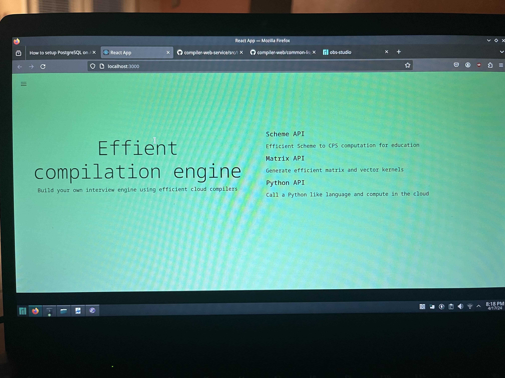
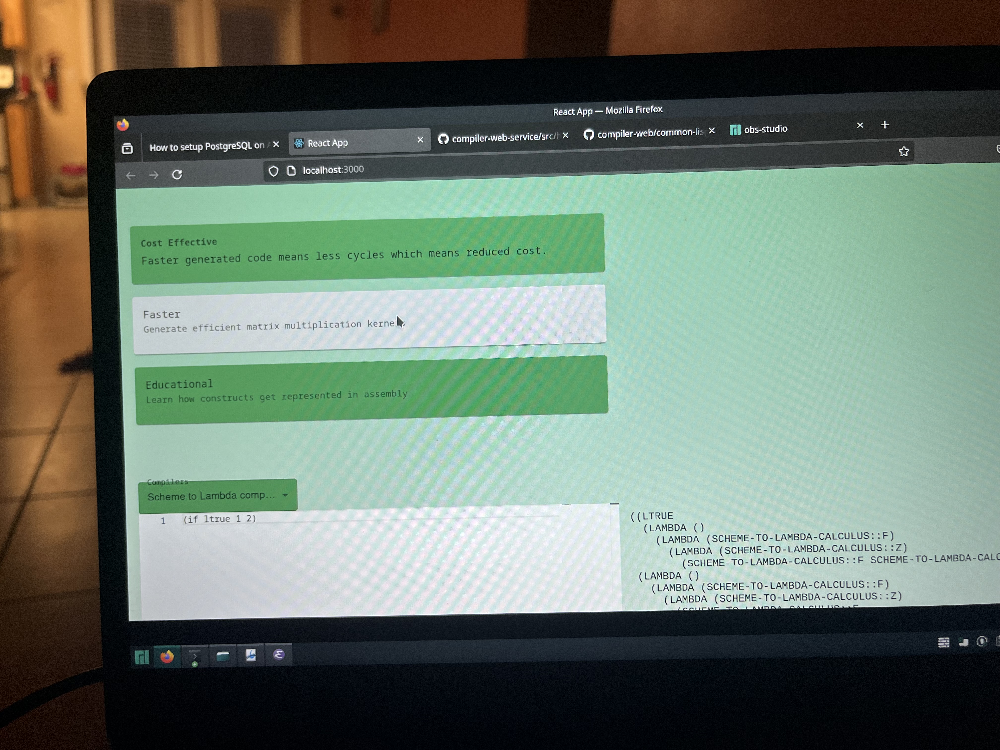
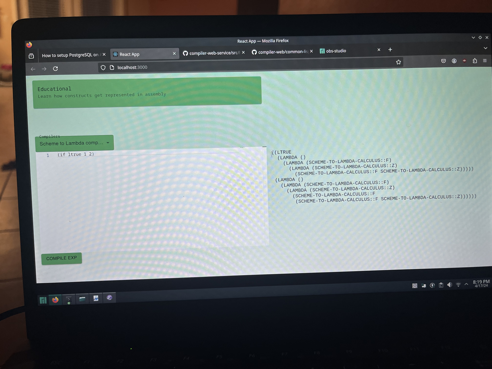

# Compiler web service
This backend consists of 4 compilers
the most substantial of which is a "Python" to x86 AST.

# Illustration



# Installation and Loading
This project depends on [JZON](https://github.com/Zulu-Inuoe/jzon), which is not on quicklisp, so:

1. Clone JZON to your ASDF/quicklisp directory (wherever SBCL knows to look -- i.e., `~/quicklisp/local-projects/`). 

2. Clone this repo (compiler-web-service) to your ASDF/quicklisp directory. 

3. Load the lambda-web system: `(ql:quickload :lambda-web)`. 

# Using the web service
## Endpoints
### GET
The following return a listing of all compiled of pairs of expressions and compiled expressions:

```
http://localhost:4243/scm-exps
http://localhost:4243/cps-exps
http://localhost:4243/py-exps
http://localhost:4243/lalg-exps
```
The following return a detailed exp,compiled exp pair:

```
http://localhost:4243/scm-exp?id=
http://localhost:4243/cps-exp?id=
http://localhost:4243/py-exp?id=
http://localhost:4243/lalg-exp?id=
```

### POST
The following creates an entry in the database:

```
http://localhost:4243/scm-compilations
http://localhost:4243/cps-compilations
http://localhost:4243/py-compilations
http://localhost:4243/lalg-compilations
```

The following returns a the compiled expression:

```
http://localhost:4243/compiled-scm-exps
http://localhost:4243/compiled-cps-exps
http://localhost:4243/compiled-py-exps
http://localhost:4243/compiled-lalg-exps
```
## Using the Scheme to lambda calculus  compiler
1. Move to this package: `(in-package #:scheme-to-lambda-calculus)`.
2. Start the REPL: `(repl)`.

       λ> (if ltrue 1 1)
       
       
       λ>
         (((LAMBDA (T) (LAMBDA (F) (T (LAMBDA (VOID) VOID))))
           (LAMBDA NIL (LAMBDA (F) (LAMBDA (Z) (F Z)))))
          (LAMBDA NIL (LAMBDA (F) (LAMBDA (Z) (F Z)))))
          

# Running the React frontend app
1. Move to `frontend` folder.
2. `npm start`.
3. pick the compiler and compile it

# Some Examples
```
(compile-scheme '(if ltrue 1 1))
(((LAMBDA (T) (LAMBDA (F) (T (LAMBDA (VOID) VOID))))
  (LAMB NIL (LAMBDA (F) (LAMBDA (Z) (F Z)))))
 (LAMB NIL (LAMBDA (F) (LAMBDA (Z) (F Z)))))
 
* (compile-scheme '(and 1 1))
(((LAMBDA (F) (LAMBDA (Z) (F Z))) (LAMB NIL (LAMBDA (F) (LAMBDA (Z) (F Z)))))
 (LAMB NIL (LAMBDA (T) (LAMBDA (F) (F (LAMBDA (VOID) VOID))))))
 
* (compile-scheme '(- 1 1))
(((LAMBDA (N)
    (LAMBDA (M)
      ((M
        (LAMBDA (N)
          (LAMBDA (F)
            (LAMBDA (Z)
              (((N (LAMBDA (G) (LAMBDA (H) (H (G F))))) (LAMBDA (U) Z))
               (LAMBDA (U) U))))))
       N)))
  (LAMBDA (F) (LAMBDA (Z) (F Z))))
 (LAMBDA (F) (LAMBDA (Z) (F Z))))
 
* (compile-scheme '(+ 0 0))
(((LAMBDA (N) (LAMBDA (M) (LAMBDA (F) (LAMBDA (Z) ((M F) ((N F) Z))))))
  (LAMBDA (F) (LAMBDA (Z) Z)))
 (LAMBDA (F) (LAMBDA (Z) Z)))
 
* (compile-scheme '(* 0 0))
(((LAMBDA (N) (LAMBDA (M) (LAMBDA (F) (LAMBDA (Z) ((M (N F)) Z)))))
  (LAMBDA (F) (LAMBDA (Z) Z)))
 (LAMBDA (F) (LAMBDA (Z) Z)))
 
* (compile-scheme '(= 0 0))
((((LAMBDA (N)
     ((N (LAMBDA () (LAMBDA (T) (LAMBDA (F) (F (LAMBDA (VOID) VOID))))))
      (LAMBDA (T) (LAMBDA (F) (T (LAMBDA (VOID) VOID))))))
   (((LAMBDA (N)
       (LAMBDA (M)
         ((M
           (LAMBDA (N)
             (LAMBDA (F)
               (LAMBDA (Z)
                 (((N (LAMBDA (G) (LAMBDA (H) (H (G F))))) (LAMBDA (U) Z))
                  (LAMBDA (U) U))))))
          N)))
     (LAMBDA (F) (LAMBDA (Z) Z)))
    (LAMBDA (F) (LAMBDA (Z) Z))))
  (LAMB NIL
   ((LAMBDA (N)
      ((N (LAMBDA () (LAMBDA (T) (LAMBDA (F) (F (LAMBDA (VOID) VOID))))))
       (LAMBDA (T) (LAMBDA (F) (T (LAMBDA (VOID) VOID))))))
    (((LAMBDA (N)
        (LAMBDA (M)
          ((M
            (LAMBDA (N)
              (LAMBDA (F)
                (LAMBDA (Z)
                  (((N (LAMBDA (G) (LAMBDA (H) (H (G F))))) (LAMBDA (U) Z))
                   (LAMBDA (U) U))))))
           N)))
      (LAMBDA (F) (LAMBDA (Z) Z)))
     (LAMBDA (F) (LAMBDA (Z) Z))))))
 (LAMB NIL (LAMBDA (T) (LAMBDA (F) (F (LAMBDA (VOID) VOID))))))
 
* (compile-scheme '(quote ()))
(LAMBDA (ON-CONS) (LAMBDA (ON-NIL) (ON-NIL (LAMBDA (VOID) VOID))))


* (compile-scheme '(letrec ((f (lambda (n) (if (= n 0) 1 (* n (f (- n 1))))))) (f 5)))
((((LAMB F) (F (LAMBDA (F) (LAMBDA (Z) (F (F (F (F (F Z)))))))))
  ((LAMB (Y) (LAMB (F) (F (LAMB (X) (((Y Y) F) X)))))
   (LAMB (Y) (LAMB (F) (F (LAMB (X) (((Y Y) F) X)))))))
 ((LAMB (F (LAMB (VOID) VOID)))
  (LAMB (N)
   ((((((LAMBDA (N)
          ((N (LAMBDA () (LAMBDA (T) (LAMBDA (F) (F (LAMBDA (VOID) VOID))))))
           (LAMBDA (T) (LAMBDA (F) (T (LAMBDA (VOID) VOID))))))
        (((LAMBDA (N)
            (LAMBDA (M)
              ((M
                (LAMBDA (N)
                  (LAMBDA (F)
                    (LAMBDA (Z)
                      (((N (LAMBDA (G) (LAMBDA (H) (H (G F))))) (LAMBDA (U) Z))
                       (LAMBDA (U) U))))))
               N)))
          N)
         (LAMBDA (F) (LAMBDA (Z) Z))))
       (LAMB NIL
        ((LAMBDA (N)
           ((N (LAMBDA () (LAMBDA (T) (LAMBDA (F) (F (LAMBDA (VOID) VOID))))))
            (LAMBDA (T) (LAMBDA (F) (T (LAMBDA (VOID) VOID))))))
         (((LAMBDA (N)
             (LAMBDA (M)
               ((M
                 (LAMBDA (N)
                   (LAMBDA (F)
                     (LAMBDA (Z)
                       (((N (LAMBDA (G) (LAMBDA (H) (H (G F)))))
                         (LAMBDA (U) Z))
                        (LAMBDA (U) U))))))
                N)))
           (LAMBDA (F) (LAMBDA (Z) Z)))
          N))))
      (LAMB NIL (LAMBDA (T) (LAMBDA (F) (F (LAMBDA (VOID) VOID))))))
     (LAMB NIL (LAMBDA (F) (LAMBDA (Z) (F Z)))))
    (LAMB NIL
     (((LAMBDA (N) (LAMBDA (M) (LAMBDA (F) (LAMBDA (Z) ((M (N F)) Z))))) N)
      (F
       (((LAMBDA (N)
           (LAMBDA (M)
             ((M
               (LAMBDA (N)
                 (LAMBDA (F)
                   (LAMBDA (Z)
                     (((N (LAMBDA (G) (LAMBDA (H) (H (G F))))) (LAMBDA (U) Z))
                      (LAMBDA (U) U))))))
              N)))
         N)
        (LAMBDA (F) (LAMBDA (Z) (F Z)))))))))))
```
